# GitHub Cheat Sheet
By Stephen Edwards, for Kikiriki Studios Canada.

# Table of Contents
- [Introduction](#introduction) 
- [Overview of Steps](#overview-of-steps) 
- [Procedure](#procedure) 
- [Creating and checking out a branch](#creating-and-checkout-out-a-branch) 
- [Making some changes to the project](#making-some-changes-to-the-project) 
- [Staging changes for commit](#staging-changes-for-commit) 
- [Committing changes](#committing-changes) 
- [Pushing changes](#pushing-changes) 
- [Creating a pull request](#creating-a-pull-request) 
- [Reviewing the changes for errors or regressions](#reviewing-the-changes-for-errors-or-regressions) 
- [Merging the branch](#merging-the-branch) 

# Introduction
Hiya. I’ll be walking you through the typical GitHub workflow on GitHub Desktop that we will be following throughout the lifespan of our project. It will consist of the following steps:

1. Creating/checking out a branch.
2. Making some changes to the project.
3. Staging changes for commit.
4. Committing changes.
5. Pushing changes.
6. Creating a pull request.
7. Reviewing the changes for errors/regressions.
8. Merging the branch.

# Overview of Steps
**_Creating and checking out a branch_** - this step allows us to start making changes to the project in an isolated environment. The “master” branch is where we want all of our work to eventually end up, but before it gets there, we want to create a sandbox of sorts to work on it. **IMPORTANT NOTE: make sure you’re on the correct branch when you sit down to do some work, or if one doesn’t exist yet, create one.**

**_Making some changes to the project_** - this is fairly self explanatory. The whole point of using GitHub is to organize additions and changes made to the project, so you really ought to do *something* to change the project (GitHub doesn’t allow you to merge a branch into another if they are identical).

**_Staging changes for commit_** - we need to tell GitHub what changes we actually want to add to the project, otherwise they will just stay on the machine you’re working on. You don’t have to stage all the changes you make, but often you will likely find yourself doing so.

**_Committing changes_** - once we have staged our changes, we actually have to bundle those up into what is known as a “**commit**”. A commit is sort of like a snapshot of what the project looks like at one point in time. So once you’ve staged changes and added a title for the commit, you can take that “snapshot”.

**_Pushing changes_** - even after making a commit, that “snapshot” still only exists on your local machine. To make them visible and available to everyone else on the team, you need to **push** that commit to our repository. 

**_Creating a pull request_** - eventually, you will want to incorporate the changes you have made into another branch - we want to see all our work come together. So just like we split off a branch to do some work, we will create a pull request to begin the process of merging that branch back in. In essence, a **pull request**specifies the **branch that is being merged**, the **branch receiving the merge**, all the **differences** between the branches (which is where someone can check for possible errors or regressions), and a BIG button to go ahead and **merge**.

**_Reviewing the changes for errors or regressions_** - we are all human. We make mistakes. So if a mistake happens to slip by when you commit and push your work, hopefully someone else on the team can catch it when examining the differences in the pull request. **This is a vital part of the development process - don’t skip out on code reviews**. 

**_Merging the branch_** - finally, once you’re confident that your changes are correct and everything is good to go, you can pull the trigger on the pull request and merge the branch. This will incorporate all the changes into the specified branch in the PR. After this, you have the option to delete the branch that was merged in; if it was dedicated to implementing one feature, it may be unnecessary to keep it lying around in the repo - please keep our project tidy :)

# Procedure
I’m going to be adding a highly requested lore page into our project, because everyone who visits our repository wants to know more about the origins of the “Battlestar Arena” universe.

# Creating and checking out a branch
I’ll be creating a feature branch, and I’ll name it “add-lore-page”. You should try and name your branches in a descriptive manner. This will be creating a branch off of master, so it will start with all the files that already exist in the “master” branch at the time of creating this branch. If you want to create a branch from one other than “master”, simply switch to it before making the new branch. 

**NOTE:**If the branch you want to work on already exists, simply select it from the list of branches. 

**IMPORTANT:** we will be naming branches like this (ft/fx depending on feature or fix):

`[ft/fx]—name-of-branch-<TRELLO_CARD_ID>`

For example, if this guide were for a real branch, and the related Trello card had id `BA-12`, I would name the branch: `ft—add-lore-page-ba-12`.

> Please keep branch names lowercased! - matootie.

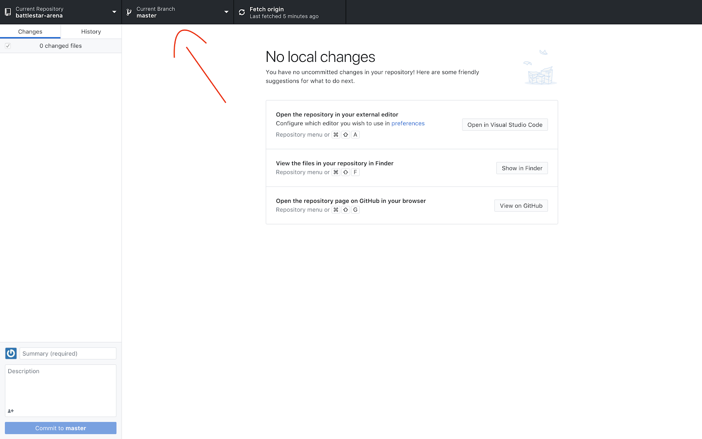

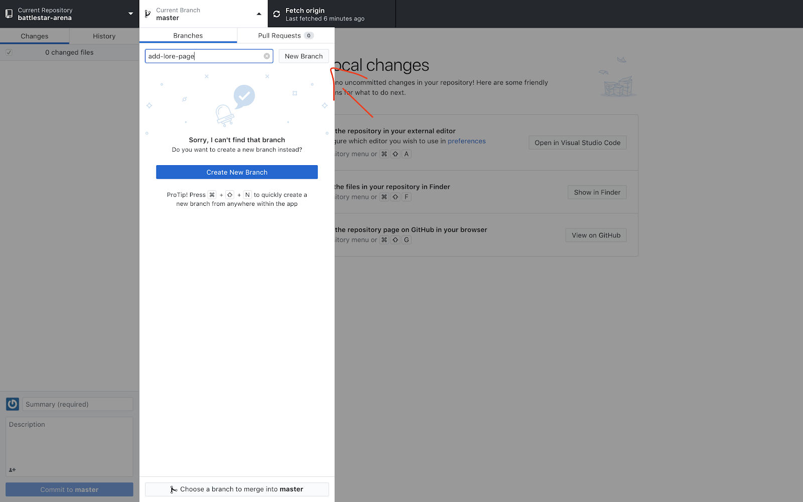

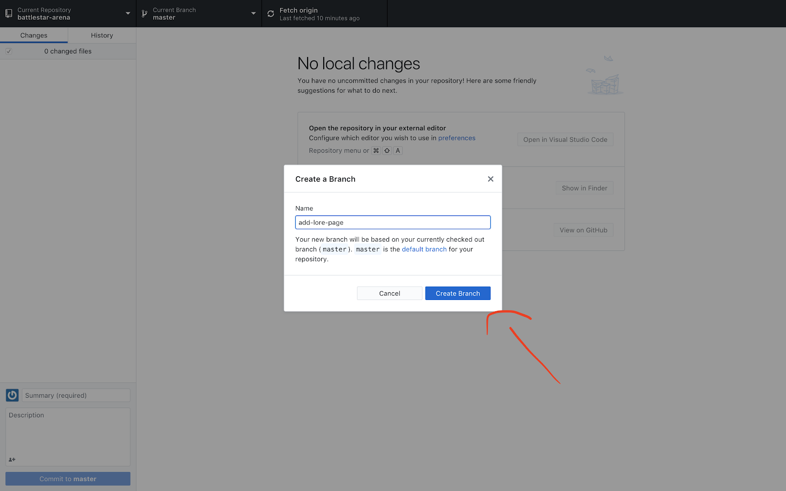

# Making some changes to the project
I’m going to create a new file in my text editor of choice then view it in GitHub Desktop.

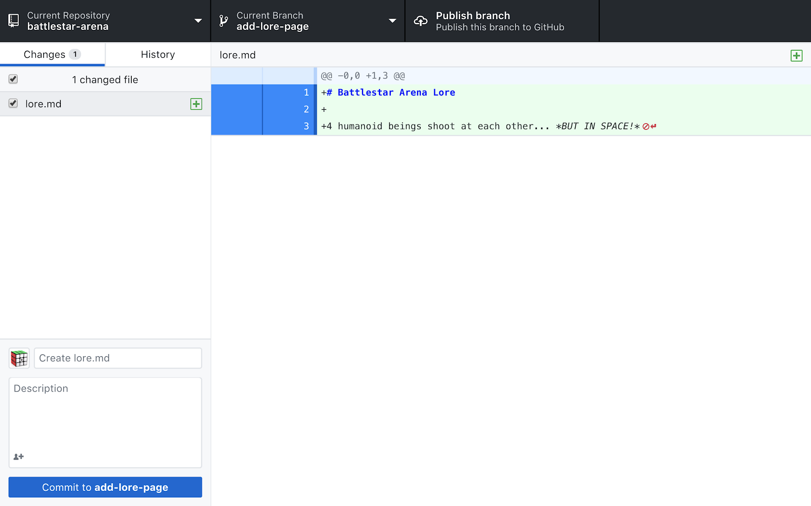

As you can see, the new file shows up in the “changes” sidebar, and since it is selected, I’m shown all the lines that were added/modified/deleted to this file since the last commit (in this case, all the lines are new since it is a brand new file).

# Staging changes for commit
In this case, I won’t actually be changing anything, however, checking/unchecking files in the “changes” tab will stage/unstage the changes in the respective files for the next commit.

# Committing changes
I’m now going to create a commit for my recent work. I’ll give it the title “created lore.md” and leave the description blank. If we can’t fit all the information we want to about the commit in the title, we can include it in the description. Finally, I’ll click “Commit to **add-lore-page**” to create the commit and add it to the current branch, add-lore-page.

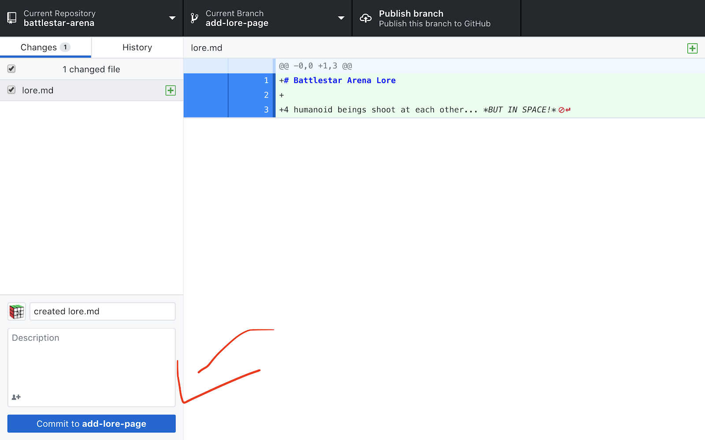

# Pushing changes
Since we created our working branch during this process, it doesn’t exist in the repository yet for everyone else on the team to see. The next step is to push our branch, including our most recent commit. This is as easy as clicking the “**Publish branch**” button. 

**NOTE:** if this branch already exists on the repository, this button will say “**Push origin”** instead.

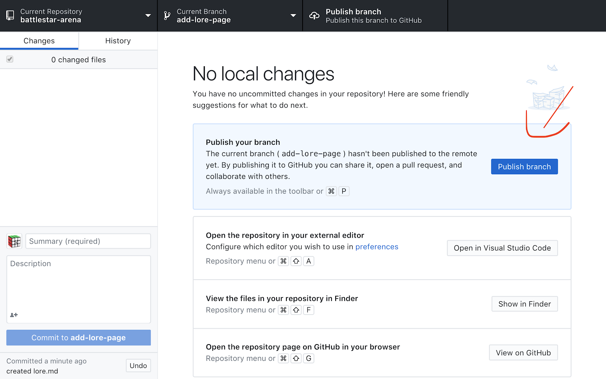

# Creating a pull request
It’s time to create a pull request! I’ll be navigate to  [https://github.com/kikiriki-studios-canada](https://github.com/kikiriki-studios-canada)  and enter the battlestar-arena repository (which can be also done via “View on GitHub”). There, I’ll enter the “**pull requests”** tab. Notice throughout this process, GitHub is letting me know that I recently pushed branches, and prompting me to create a pull request (I could click on any of those prompts instead of creating one manually).

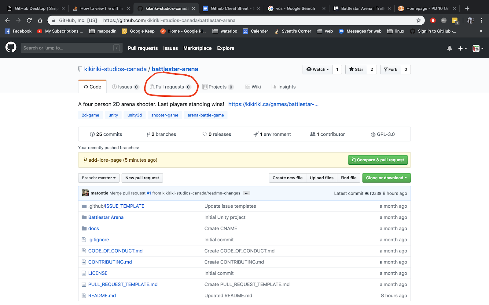

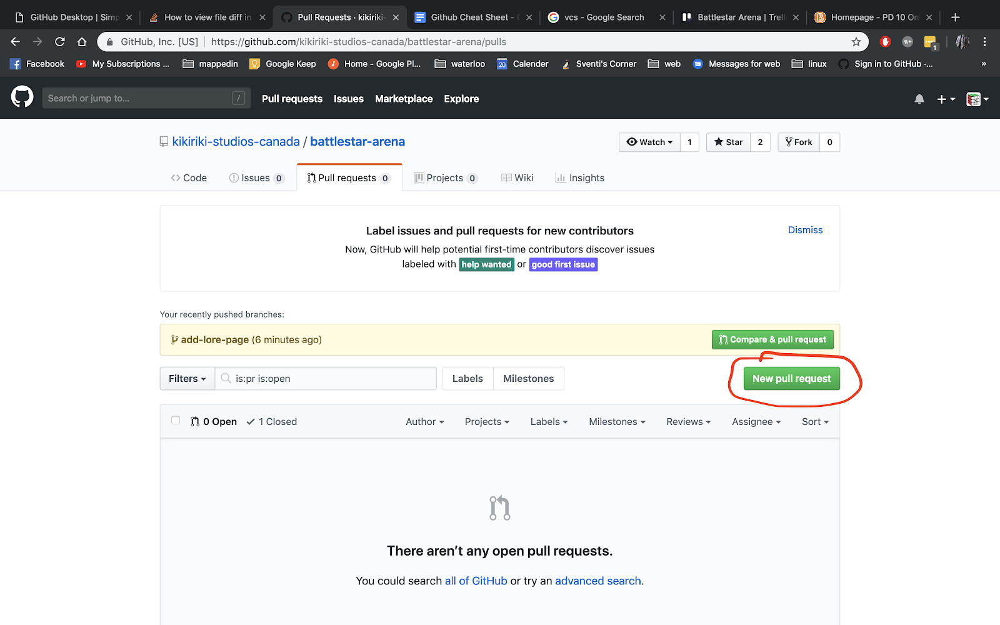

Next, I’m going to select the branch that I want to merge into (this case) master. 

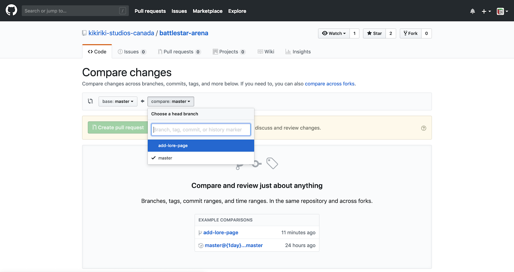

And finally, after looking it over, I’ll finish creating this pull request.

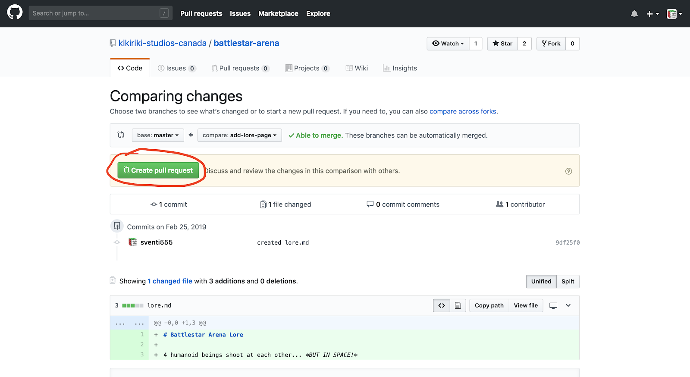

Here, I have the chance to add a description about what changes I’ve made in this branch. I’m going to leave it blank because the title explains it (similar to how I left it out in the commit).

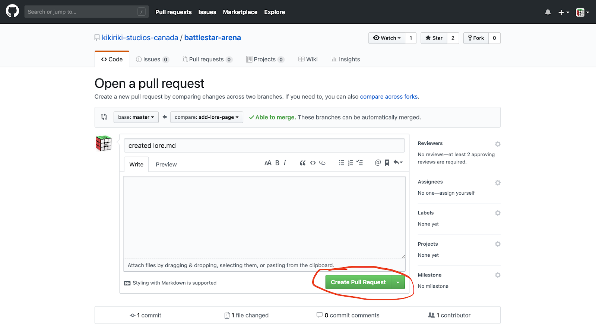

# Reviewing the changes for errors or regressions
Ideally, this step would be done by a couple team members that you trust to review your work. So I would approach someone who has knowledge about the game’s lore to validate what I added. Presuming Mateja knows all there is to know about lore, I’m going to request that he reviews my pull request. 

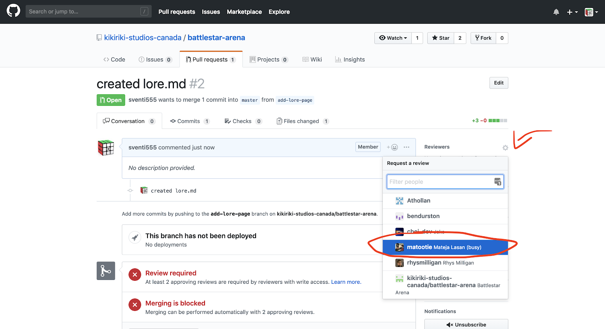

Mateja will now be notified that I have requested his review, and he can come make comments and suggestions on this pull request. As he makes suggestions, assuming they have some validity to them, I should go back, make those changes, then create a new commit and push it. Those changes will be reflected in the pull requested as they are made.

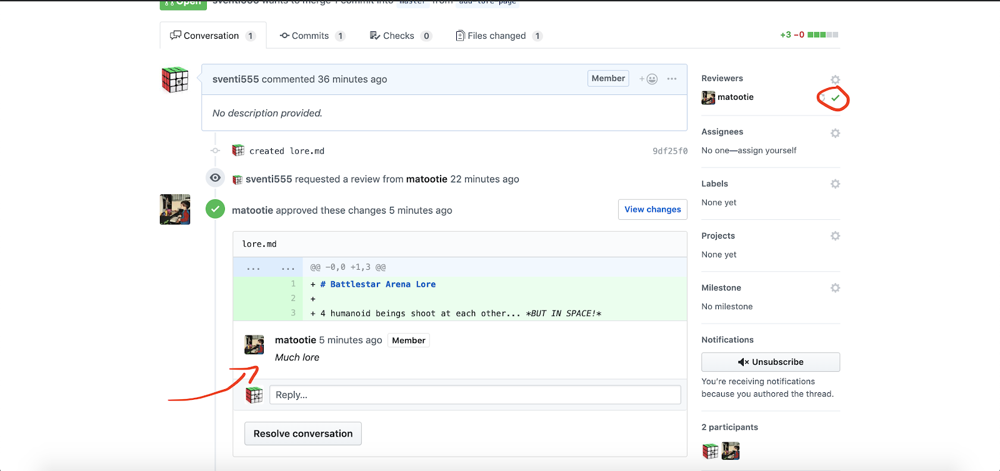

Mateja gave a review and approved the request, so I can proceed with the merge.

# Merging the branch
Once you have the minimum number of approvals on your PR, you can execute the merge (unless it is into “master”, then a repository admin will need to assist you). 

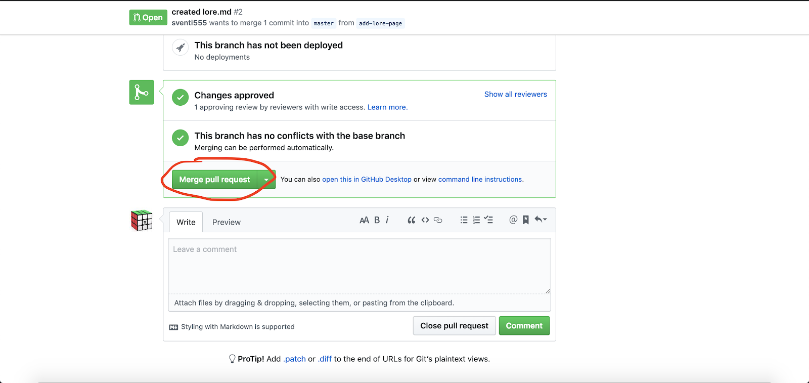

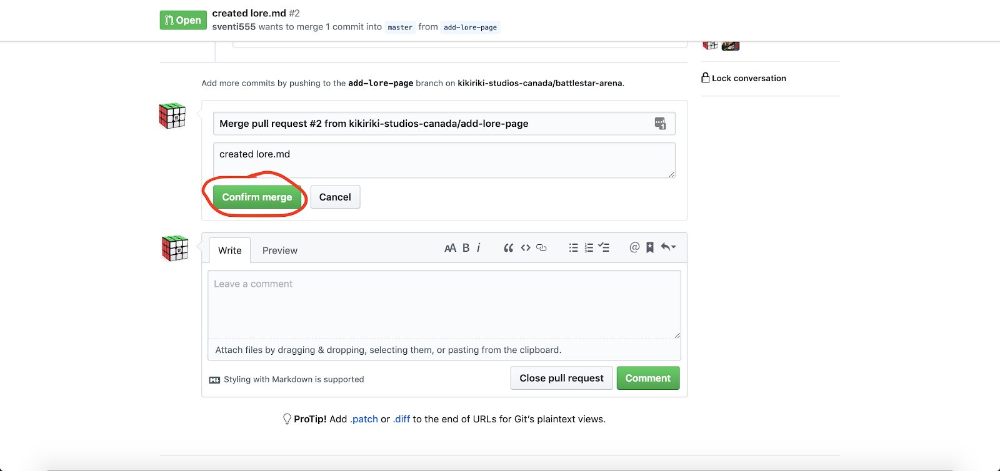

Now that the branch is merged in, it is no longer needed, and can be deleted from the repository.

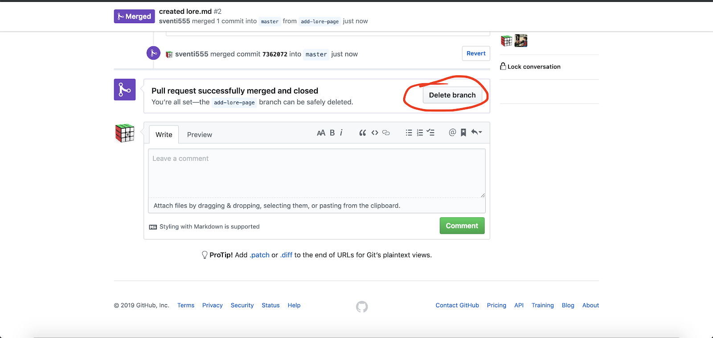

We now see that the master branch contains the changes we made in our feature branch. That’s it! We’ve just added a new feature to our project using GitHub.

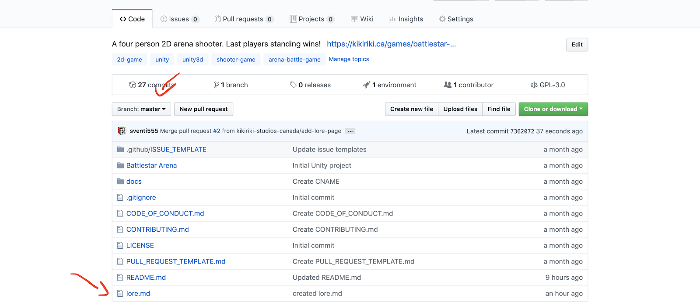

# Wrap-Up
GitHub’s capabilities go far beyond what were shown in this reference guide, however, this will get you well on your way to being comfortable working with it. If you have any suggestions on how to improve this guide, I’d gladly hear them. Thanks.

~/sven
